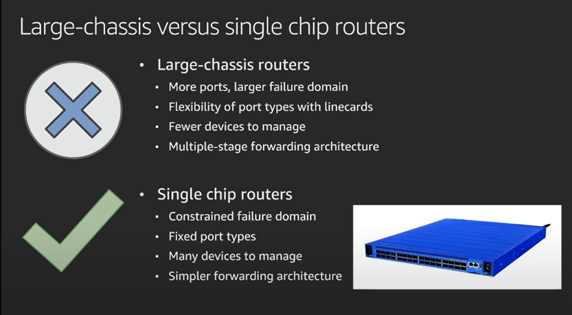
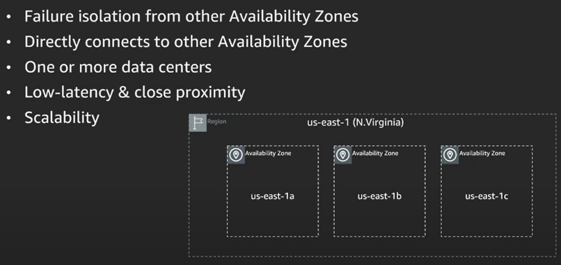
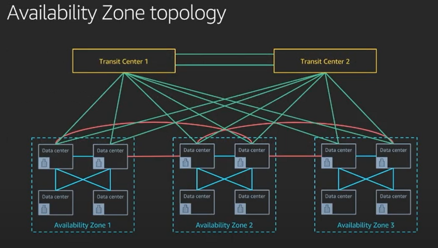
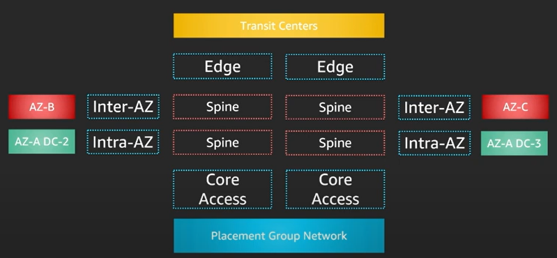
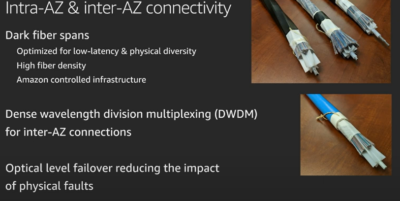
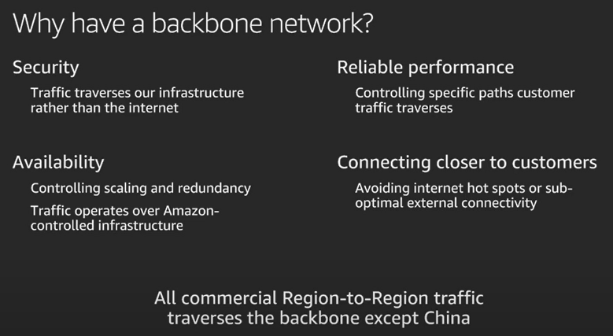
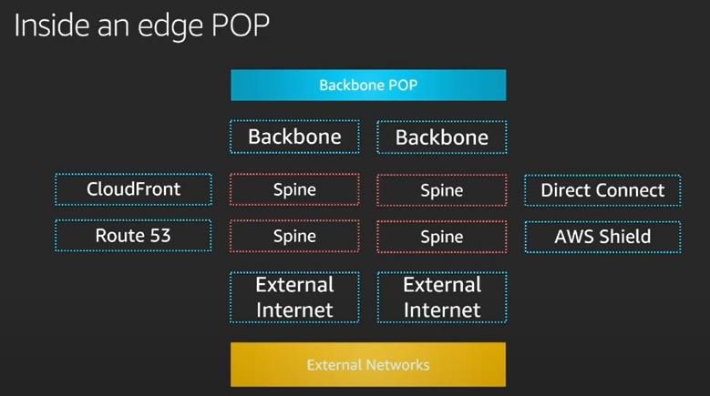

# AWS Architecture Funadamentals
## Host Network Features

New feature in Nitro --> VPC Encryption

## AWS Data Center Network
### Regions and Availability Zones

### Large chassis based platforms

- Linecard
    - Physical ports you can attach to
- Switch fabric cards
    - To integrate linecards
- Control plane CPU (brain)
    - To cordinate all parts inside the box synchronizingly
- massive devices/complex to troubleshoot/difficult to CPU size due to large no of ports

### Single Chip based platforms

- modern net devices
- easy CPU sizing since you know how many ports are required when you built it

### Large Chassis VS, Single Chip based platforms

### Building Blocks of a DC network
- Blocks
    - Host racks (contains physical servers that run the AWS services)
    - Routers
    - Connectivity
    - Control Planes

- Network colors --> to recognize the generation since the switches has the same layout and looks the same
    - black - gen 1
    - blue - gen 2
    - green - gen 5 (latest)

1. Host Rack Networking
    - Partition placement --> EC instances inside a partition shares a host rack
    - Spread placement (max 7 instances) --> Individual instances has their own host rack

2. Access Cell - Attaching Host Racks
    - Top tier (ports for out of DC - north band)
    - Bottom tier (provide ports to connect host rucks)
    - Topology between tiers (device in one layer has at least one connection to all the devices in the other layer)
    - Host racks connect to two/more routers in bottom tier

3. Placement Group Net - Multiple Access Cells
    - spine cell (communication between access cells - Inter DC comm)

4. Cellular Net Pattern
    - core cells (provide connectivity out of DC)

### Operating a network of many devices
- Device Lifecycle (Connecting and maintaining devices)

    

- Network Monitoring (Making sure everything works alright)

    

- Automated remediation/repair (Handling issues)
    - If removing the device from the network doesn't resolve the issue, the issue is raised to an engineer. Otherwise all software related remedies (Eg: Rebooting the router, restarting)

    

## Availability Zones
- Scalability --> By adding more DCs
- Physically not connected (Hence, isolated)

    

- AZ Topology
    - All Data Centers inside an AZ are interconnected
    - All AZs connect to Transit Center. Therefore, all AZs are interconnected
    - Transit Center (Interconnection between the AZs)
    

### Building Cellular DC Arch
- Spine cells connect other DCs in other AZs (Eg: AZ-A DC1 and AZ-B DC1)

    

### Inter and Intra-AZ Connectivity
- Black cables --> Intra

### AWS Global Backbone

### Inside an Edge POP
