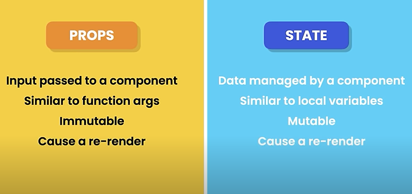

### Commands

1. To create a new app from Vite's standard React template  
   `npm create vite@latest react-test -- --template react`  
   `npm create vite@latest` --> and complete the installation process

2. cd to react-test dir, install the app's dependencies, and run the app locally (downloads node_packages)  
   `cd react-test && npm install`

3. Start/run a local dev server and open the app in browser on port 3000 once the server starts  
   `npm run dev -- --open --port 3000`

4. To install bootsrap  
   `npm i bootstrap`

### Application Structure

1. index.html

   - Vite injects your code into this file so that your browser can run it
   - we dont edit this
   - title - editable

2. public

   - static files that will be served directly to your browser without being processed by Vite's build tooling
   - images/video files you can see on the app

3. src

   - main code

4. package.json | package-lock.json ---> contain metadata on the proj

5. index.html
   - contains the root of the app and the var (src="/src/main.tsx">) containing the entry point of the app (App.tsx)

--- Basic React Component ---
import
Component()
export

### Random Notes

1. prop vs attributes

   - attribute - to pass values into plain elements
   - props - to pass values into React components - parent components down to child components

2. useState - Hook (A hook is used to use React's features in a component)

3. Ways to create a React app

   - Create React APP (CRA) - by React team
   - Vite

4. Boostrap

   - To give the app a modern look/feel
   - To create list group components
   - CSS lib

5. State v Props
   

6.
